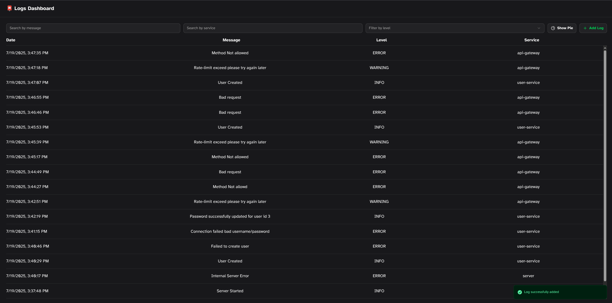
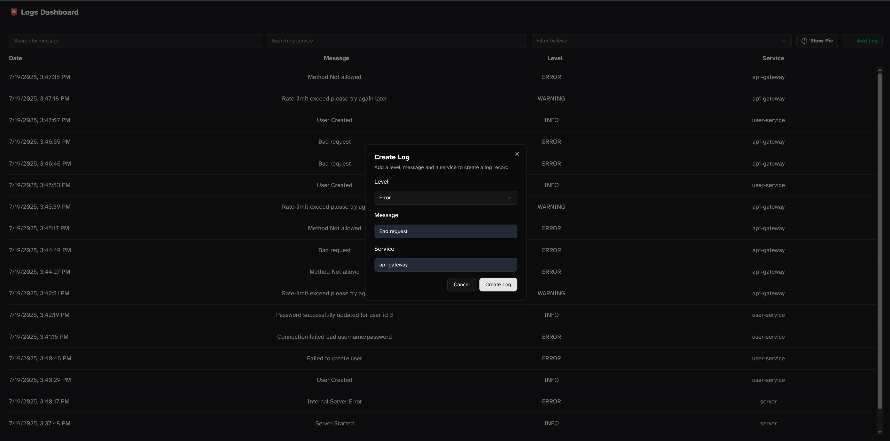
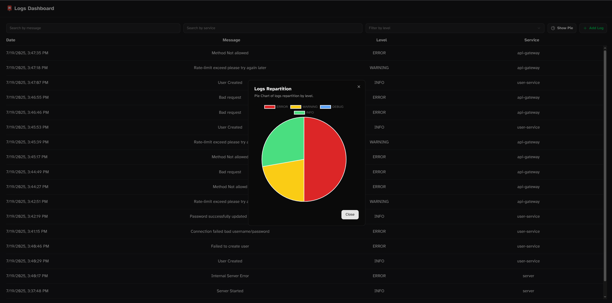

# 📮 Full Stack Logs App

App full stack to store and search for logs built with FastAPI, OpenSearch, React and TailwindCSS.

## Features

- View logs
- Search logs by message and/or by service
- Filter logs by level
- Add logs by filling form

## Bonus

- Real time update with websockets
- PieChart with ChartJS
- Kubernetes deployment see `kubernetes` branch for more information

## ⚙️ How to deploy

```bash
cp .env.example .env && make
```

## How to access

If you are using default value you can navigate to `http://localhost:3000`

## Preview

<p float="left">
  
  
   
</p>
